## 技术选型介绍

1、使用 vue3 + springboot 进行前后端分离 开发

2、对移动端进行了自适应

3、安全靶场中对已有靶场进行表格展示，显示历史完成百分比，
动态展示当前登录用户已完成的挑战

4、登录用户可以自行开启靶机（金币够用，限时半小时），打靶
成功后更具靶机回馈的 flag，进行提交，提交后更新状态

5、用户开启靶机，对是否开启过及金币进行判断，而后根据不同
的靶机使用 docker 创建靶机环境，返回容器名及端口，后根据端
口使用 nginx 进行端口转发，返回转发后的域名，保存数据，保
存一份到 redis，利用 redis 倒计时及 springboot 回调功能，对到
期容器进行到期删除，返回前端，用户根据域名进行打靶

6、在线编程部分使用了 codermirror，对用户填写的代码进行高
亮显示及代码提示 使用可以书写 Java、python 等语言进行运行

7、用户点击代码运行，服务端根据用户选择的语言向 node 服务
端发起 socket 连接，创建 docker 容器，在容器内执行代码，返
回执行成功的内容，断开 socket 连接，返回前端

8、在线编程页面，用户也可以分享自己写完的代码，发到后端，
返回并展示二维码图片，其他用户可以直接扫码获取代码运行

9、社区部分展示用户讨论数据、发布文章部分使用 wangediotr
进行文章编辑、文章详情部分展示内容以及 highlight 库对代码进
行高亮显示

10、使用了 vue-dompurify-html 过滤可能存在得 xss 攻击，使用 i18n 对网站进行国际化

11、使用 spring security + jwt 完善权限系统，可动态新增/编辑用户权限，精确到按钮级权限

开发 ing...

## 展示图（大同小异的部分就不展示了）

### 首页部分
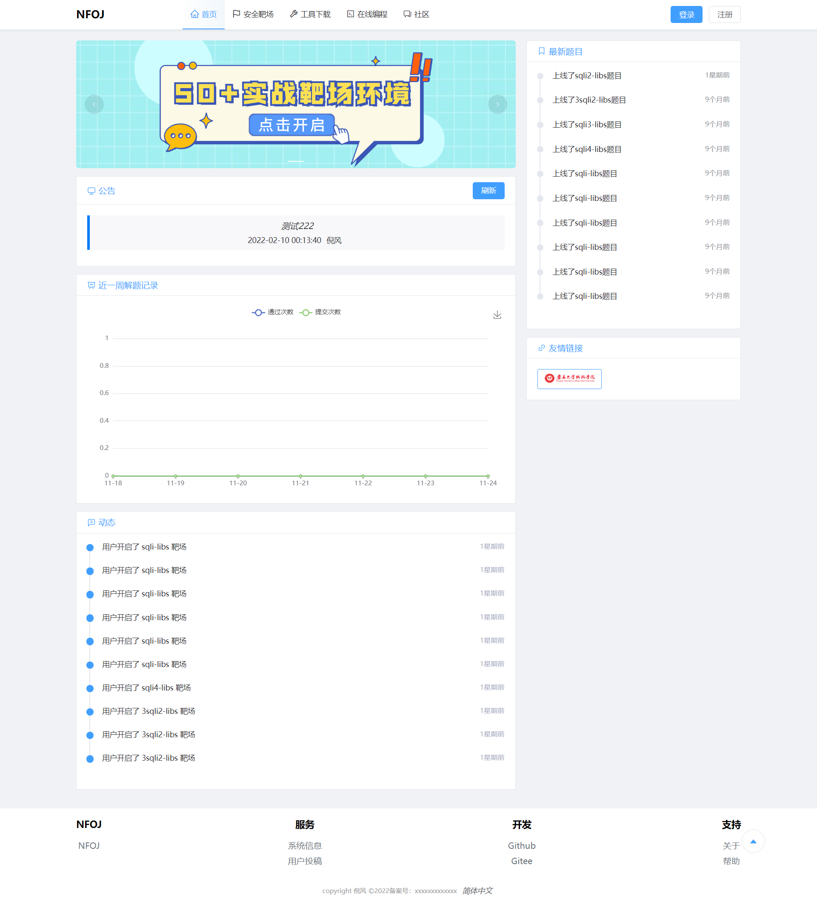

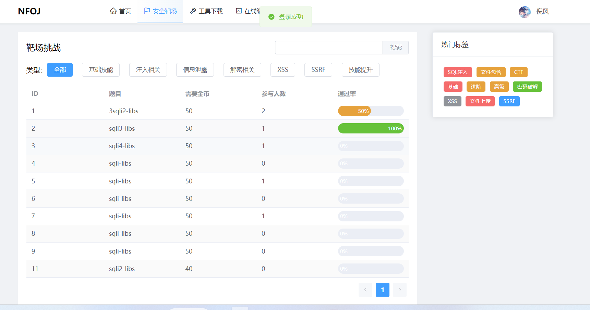
## PS：开启靶机和在线编程部分因为服务器刚过期，就暂时不展示了，之后本地部署后再添加
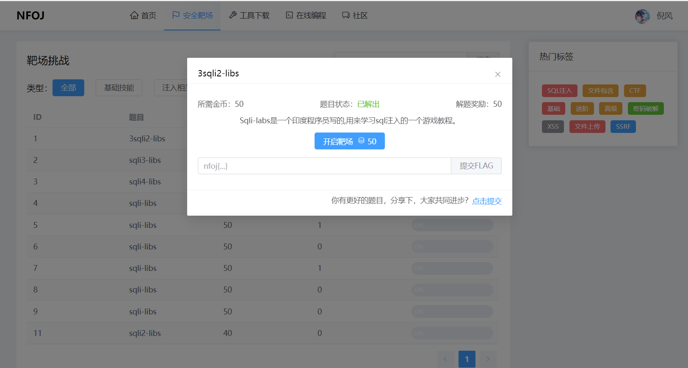
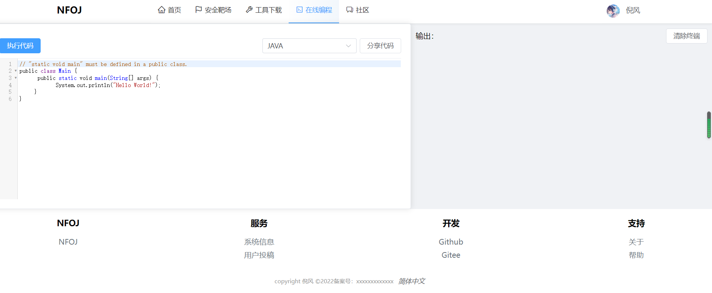
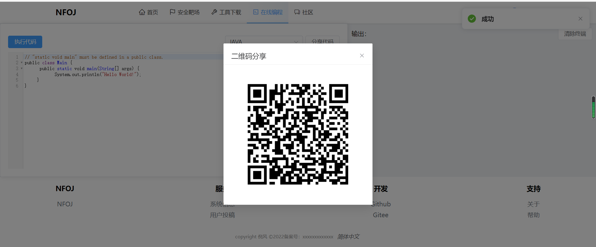
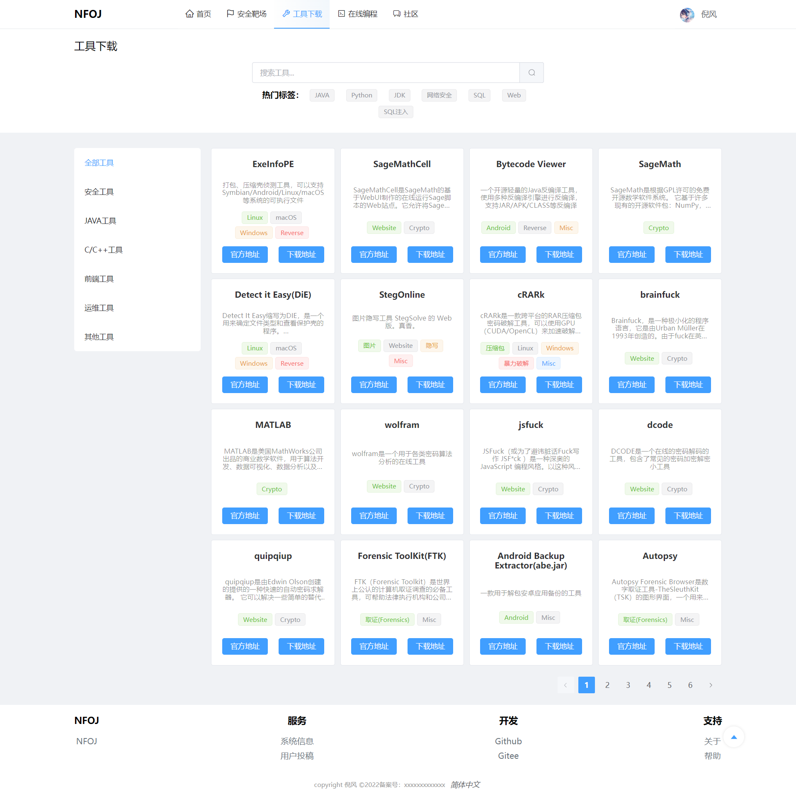

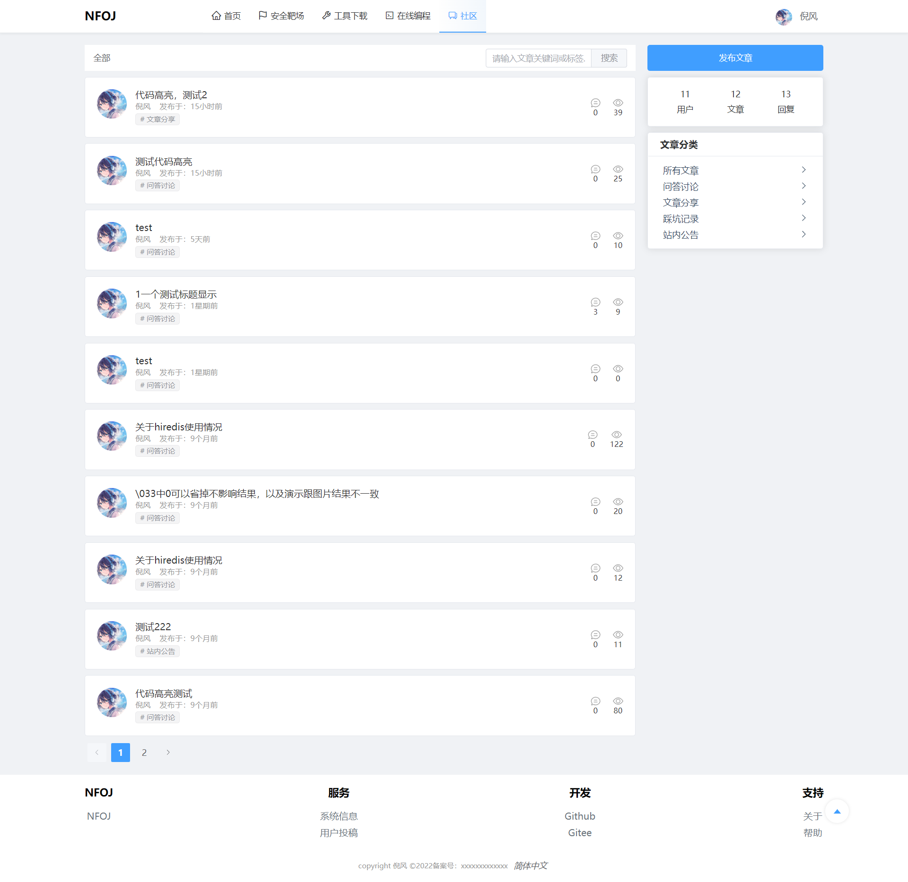
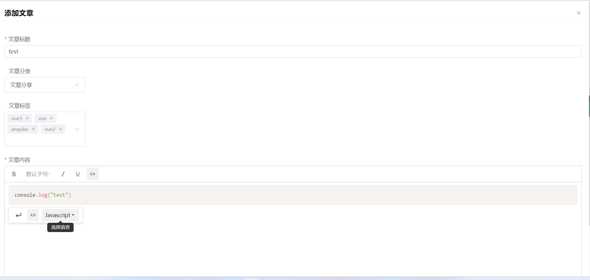
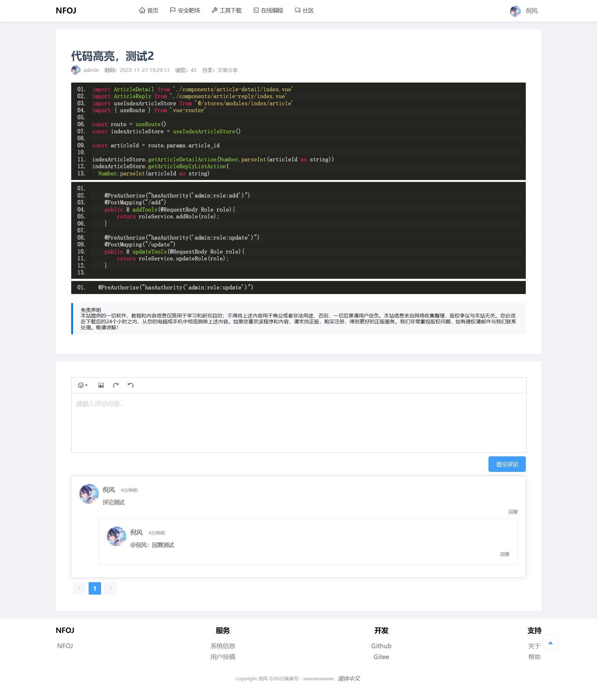

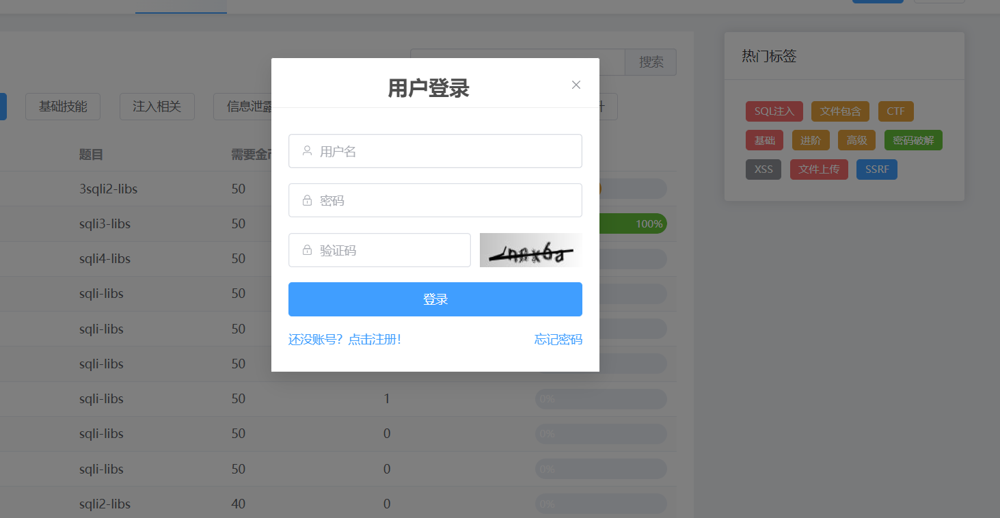

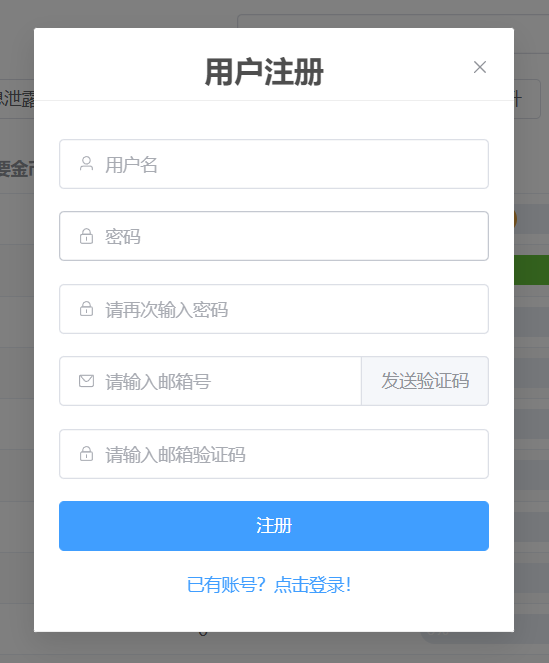
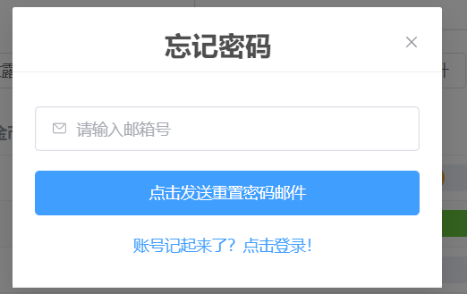
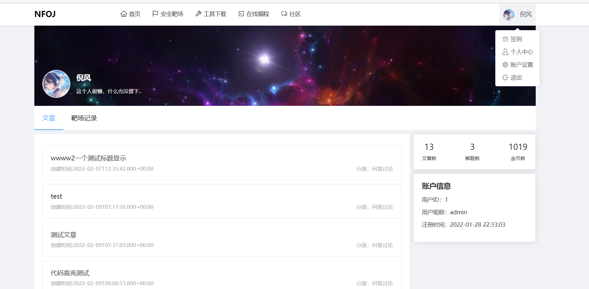
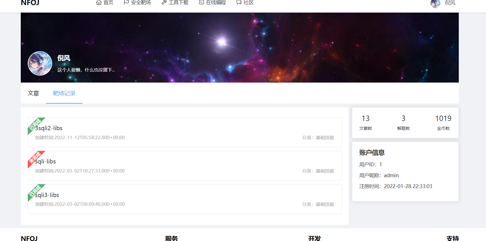
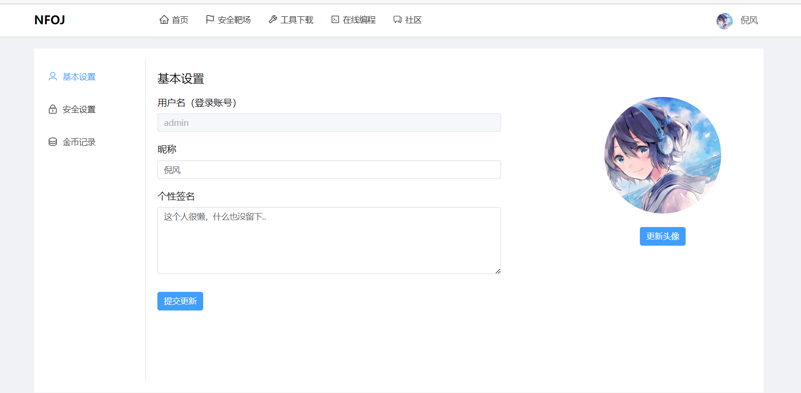

### 后台部分（因为增删改查都差不多，所以只展示一些不同的）
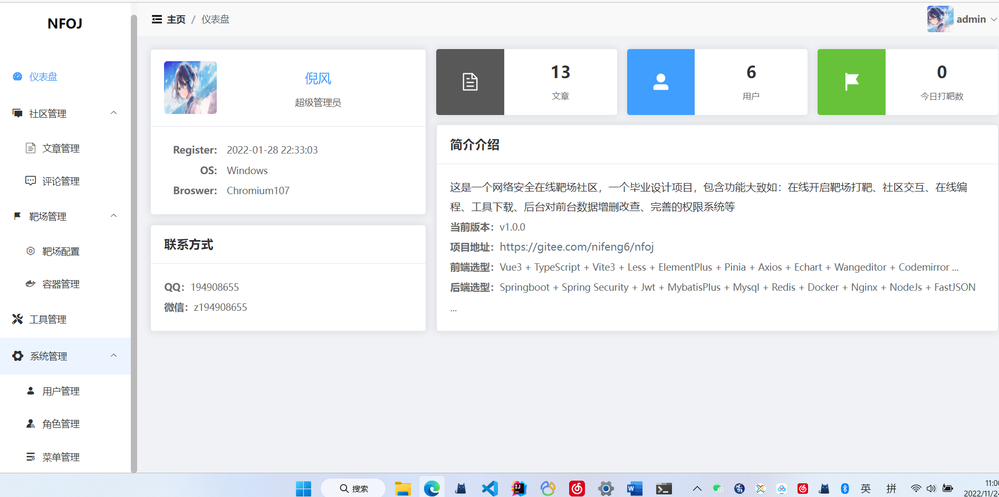
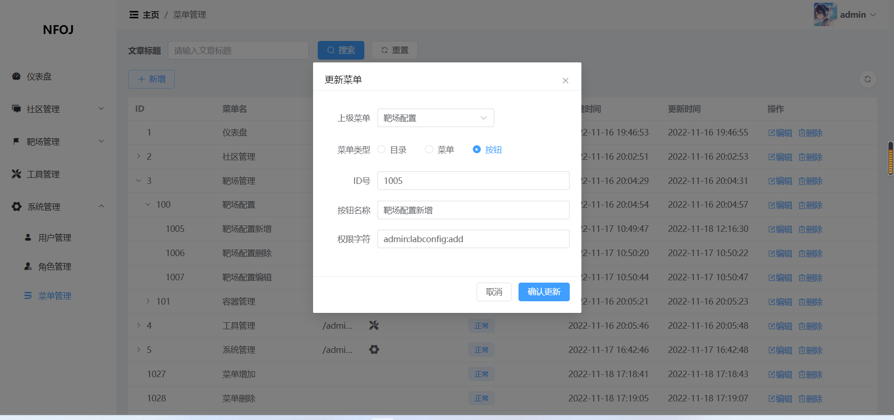
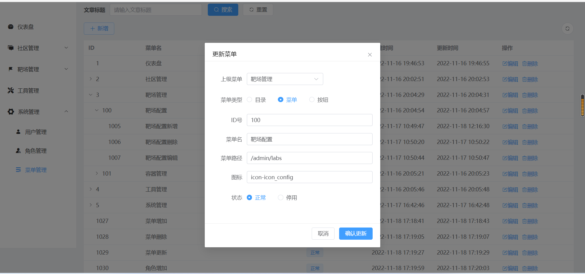
